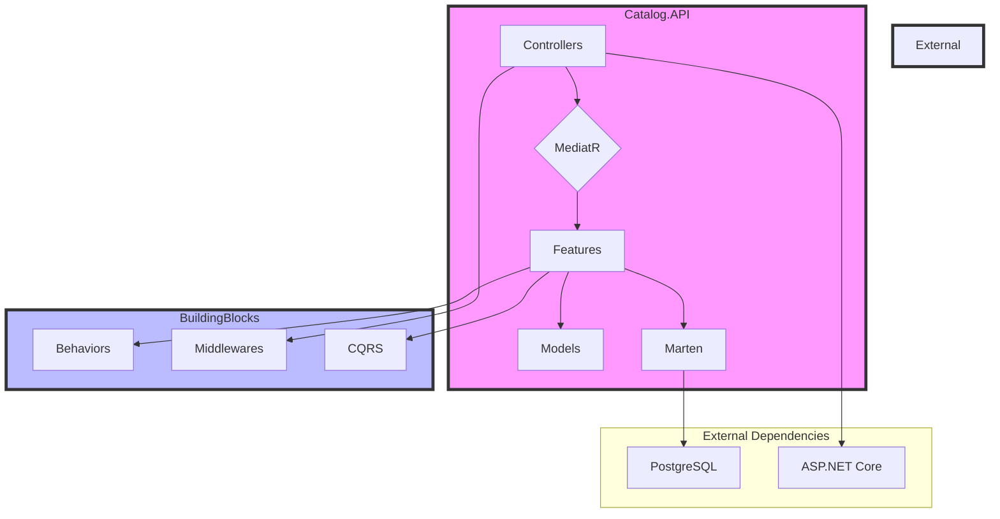

# eshop-ynov-MAVA

## Catalog.API Component Diagram

```mermaid
graph TD
    subgraph Catalog.API
        direction LR
        A[Controllers] --> B{MediatR};
        B --> C[Features];
        C --> D[Models];
        C --> E[Marten];
    end

    subgraph BuildingBlocks
        direction LR
        F[Behaviors]
        G[Middlewares]
        H[CQRS]
    end
    
    subgraph External Dependencies
        direction LR
        I[PostgreSQL]
        J[ASP.NET Core]
    end

    C --> F;
    A --> G;
    C --> H;
    E --> I;
    A --> J;

    style Catalog.API fill:#f9f,stroke:#333,stroke-width:4px
    style BuildingBlocks fill:#bbf,stroke:#333,stroke-width:4px
    style External Dependencies fill:#ccf,stroke:#333,stroke-width:4px
```